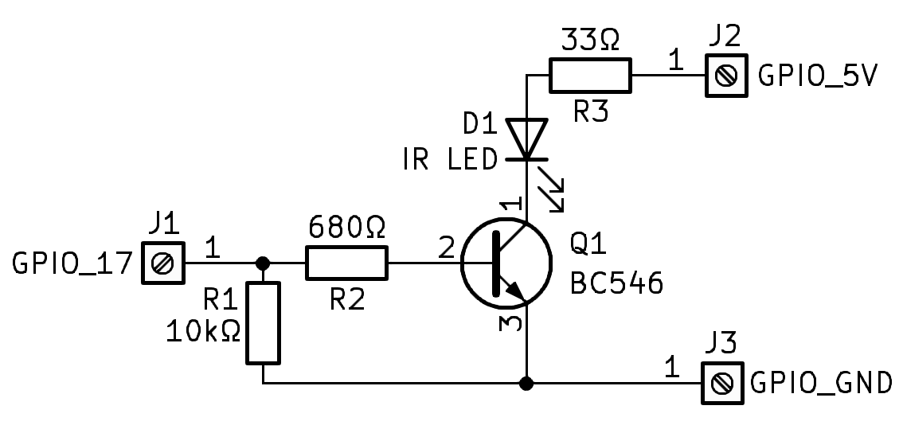

# TV-B-Gone for raspberry pi
This repository contains implementation of the TV-B-Gone project, it is in simple terms universal remote that turns off all televisions within its range. Original TV-B-Gone was created by Mitch Altman, nowdays, there are a lot of implementations, but I have never seen any for raspberry pi, so this is it. I also added option to save and replay your own codes with irrp.py - IR example from official pigpio library. 
# Requirements
The script requires pigpio library to work, you can install it by running:
```
wget https://github.com/joan2937/pigpio/archive/master.zip
unzip master.zip
cd pigpio-master
make
sudo make install
```
# Usage
To use the script, make it executable with chmod and then simply run it with bash.
```
sudo chmod +x menu.sh
./menu.sh
```
It will enable pigpiod and throw you to menu, where you can choose either running TV-B-Gone codes, or save, replay, delete your custom code and also exiting the script, this will also kill pigpiod.
# Transmitter circuit
Because IR Leds use microsecond pulses, you can drive them to 100mA without problem. I used 940nm IR Led from some remote. Circuit helps to deliver this current, because raspberry pi can deliver maximum 16mA per pin. If you want to use different current, go to the instructables website for instructions.


# Receiver circuit
Circuit uses TSOP1838 IR receiver, but you can also use TSOP38238 or similar, but make sure it outputs over 3 volts when no signal is detected. Other components are based of the datasheet and are not really needed, I used them only to fill up extra space on universal board.


# External references
- https://learn.adafruit.com/circuitpython-tv-zapper-with-circuit-playground-express/overview - classic TV-B-Gone codes
- https://github.com/bikeNomad/micropython-tv-b-gone - new codes from universal TV remote
- https://abyz.me.uk/rpi/pigpio/index.html - pigpio library website
- https://www.tvbgone.com/ - original TV-B-Gone website
- https://www.instructables.com/Raspberry-Pi-Zero-Universal-Remote/ - Calculating IR LED, other good tips
# TO DO
- Fix some errors - doubled text, cancel function
- More functions, possibilities...
